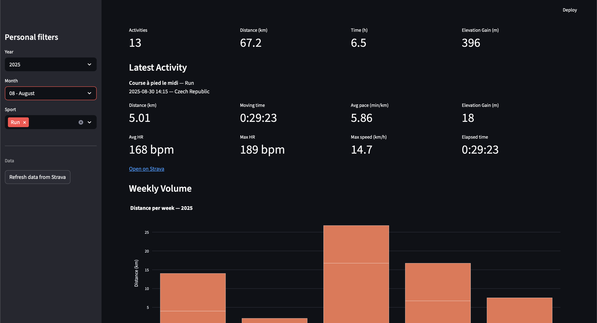

<div align="center">
  <div>
    
    
    
    
    
  </div>
</div>

# Personal Strava Dashboard - React

Modern, responsive Strava dashboard built with React, Vite and Tailwind CSS. It shows weekly KPIs, your latest run. Data is read from a JSON file you export from Strava.

## Features
- Weekly KPIs: mileage, avg HR, training load change
- Last run: distance, moving time, pace, HR, elevation, energy
- Personal bests: projected times for 1k, 5k, 10k, Half-marathon, 30k, marathon
- Dark mode, smooth animations, responsive layout


## Quick Start (React)

```bash
npm install
npm run dev
```
Open the local URL printed by Vite. To see metrics, add a `public/data/activities.json` file (see “Get your data”).
## Get your data (Strava export)
Use the Python exporter in `python/export_data.py` to pull your activities from the official Strava API.
1) Create Strava API credentials: https://www.strava.com/settings/api (scopes: `read,activity:read_all`)
2) Put credentials in `python/.env`:
```
STRAVA_CLIENT_ID=...
STRAVA_CLIENT_SECRET=...
STRAVA_REFRESH_TOKEN=...
```
3) Export activities to JSON:
```bash
python python/export_data.py --out data/activities.json
```
4) Make the JSON available to the app by copying it to `public/data/activities.json`.
The app fetches `/data/activities.json`. Supported shapes:
- Object: `{ "exported_at": ISO-8601, "count": N, "activities": [ ... ] }`
- Array: `[ ... ]` also works (no `exported_at`)
## Scripts
- `npm run dev`: start Vite dev server
- `npm run build`: production build to `dist/`
- `npm run preview`: preview the prod build
- `npm run lint`: run ESLint
Note: The “Fetch your data!” button calls


# Personal Strava Dashboard - Python :snake:

Simple Streamlit dashboard to explore your Strava activities with quick charts and KPIs. Data is exported from the official Strava API, then visualized locally.



## 🚀 Quick Start


```bash
git clone https://github.com/yourusername/strava-dashboard.git
cd strava-dashboard
python3.12 -m venv .stravadash
source .stravadash/bin/activate
pip install -r requirements.txt
streamlit run streamlit_app.py
```


## ⚙️ Setup

### Create and activate virtual environment
```bash
python3.12 -m venv .stravadash
source .stravadash/bin/activate  # on macOS/Linux
```
On Windows: `.stravadash\Scripts\activate`

### Install dependencies
```bash
pip install -r requirements.txt
```

Python version: the project targets Python `3.12` (see `.python-version`). Other versions may work but are not tested here.


## 🏃‍♂️ Strava Setup

1. Go to [Strava API settings](https://www.strava.com/settings/api) and create an application.
   - Use `localhost` as Authorization Callback Domain during local development.
   - Note down your **Client ID** and **Client Secret**.

2. Authorize the application with the proper scopes:
```
https://www.strava.com/oauth/authorize?client_id=YOUR_CLIENT_ID&response_type=code&redirect_uri=http%3A%2F%2Flocalhost%2Fexchange_token&approval_prompt=force&scope=read,activity:read_all
```

3. After login/authorization, copy the `code` parameter from the redirect URL.

4. Exchange the code for tokens:
```bash
curl -X POST https://www.strava.com/oauth/token \
  -d client_id=YOUR_CLIENT_ID \
  -d client_secret=YOUR_CLIENT_SECRET \
  -d code=AUTH_CODE \
  -d grant_type=authorization_code
```

This returns an `access_token` (short lived) and a `refresh_token` (long lived).

1. Add credentials to `.env` :
```
STRAVA_CLIENT_ID=...
STRAVA_CLIENT_SECRET=...
STRAVA_REFRESH_TOKEN=...
```

Notes:
- The export script will first look for `.env` next to `export_data.py`, then fall back to the current working directory.
- Ensure your token scopes include `read,activity:read_all`.

## 📥 Data Import

### Export data
```bash
python python/export_data.py --out ./data/activities.json --per-page 200
```

or as CSV:
```bash
python python/export_data.py --out data/activities.csv --per-page 200
```

You can filter by dates:
```bash
python python/export_data.py --out data/activities.json --after 2025-01-01 --before 2025-12-31
```

Show all options:
```bash
python python/export_data.py -h
```

Output examples:
- JSON: `{ "exported_at": ..., "count": N, "activities": [...] }`
- CSV: flattened fields (distance, times, heart rate, etc.)

By default, files are written under `data/`. Create the folder if needed.

## 📊 Run the Dashboard

Start Streamlit locally:
```bash
streamlit run streamlit_app.py
```

In the app sidebar, click “Refresh data from Strava” to re-export and reload `data/activities.json` without leaving the app.

## 📂 Project Structure

- `export_data.py`: CLI exporter for Strava activities (JSON/CSV)
- `streamlit_app.py`: Streamlit dashboard (charts, KPIs, filters)
- `data/`: exported datasets
- `.env`: Strava credentials (`STRAVA_CLIENT_ID`, `STRAVA_CLIENT_SECRET`, `STRAVA_REFRESH_TOKEN`)
- `requirements.txt`: pinned dependencies

## 🛠️ Troubleshooting

- Unauthorized 401: refresh token invalid or missing scopes. Re-run OAuth and update `.env`.
- No data in app: ensure `data/activities.json` exists and is valid JSON (or click “Refresh data”).
- Missing columns error: export as JSON for the app (`.csv` is for external analysis).
- Rate limits: the exporter paginates; if you hit limits, reduce `--per-page` or try later.
## 📝 Notes

- Keep `pip`, `setuptools`, and `wheel` up to date for smoother installs.
- If Streamlit fails to launch, try: `pip install --upgrade streamlit`.
